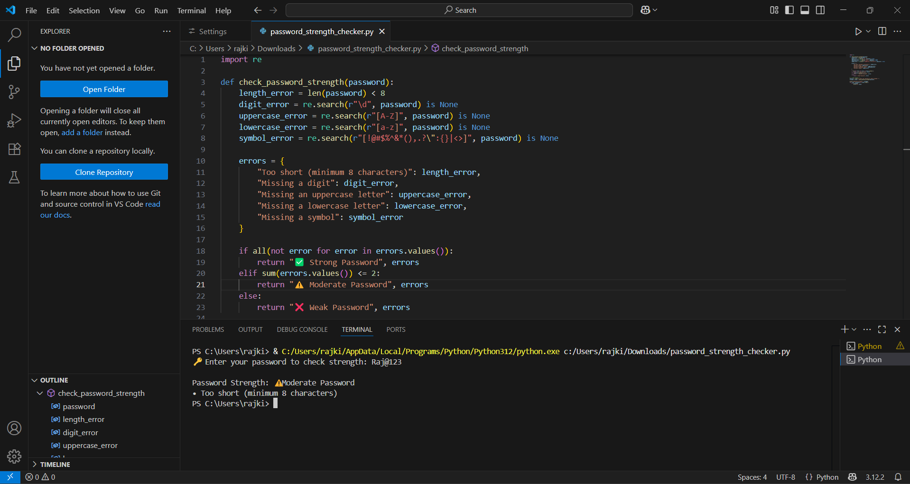

# password-checker-task
Created a Python tool to evaluate the strength of passwords based on rules such as length, digits, uppercase, lowercase, and symbols.  This project was built as part of my Cyber Security Internship at Prodigy InfoTech to demonstrate real-world input validation and security logic.
Created a Python tool to evaluate the strength of passwords based on commonly accepted rules like:
- Length
- Digits
- Uppercase and lowercase letters
- Special characters

Built as part of my **Cyber Security Internship at Prodigy InfoTech**, this tool helps demonstrate secure password validation practices.
💡 Features:
- Identifies weak, moderate, or strong passwords
- Gives real-time suggestions on what’s missing
- Fully terminal-based and interactive

## 🛠️ Tech Used:
- Python
- Regex (`re` library)

